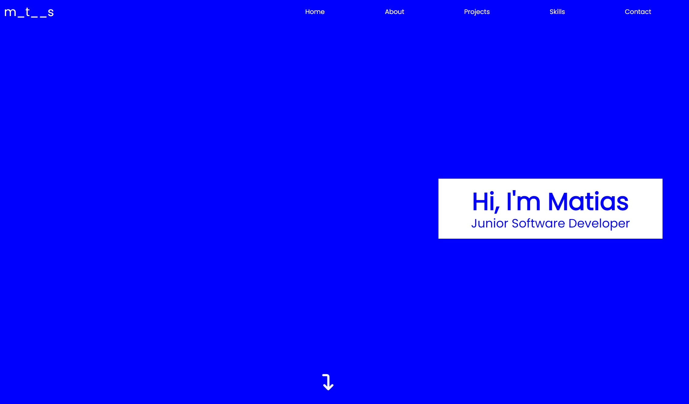
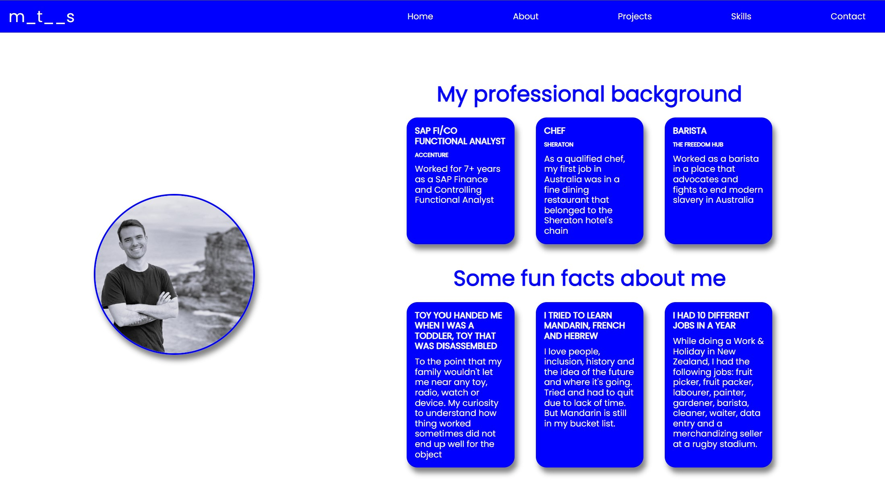
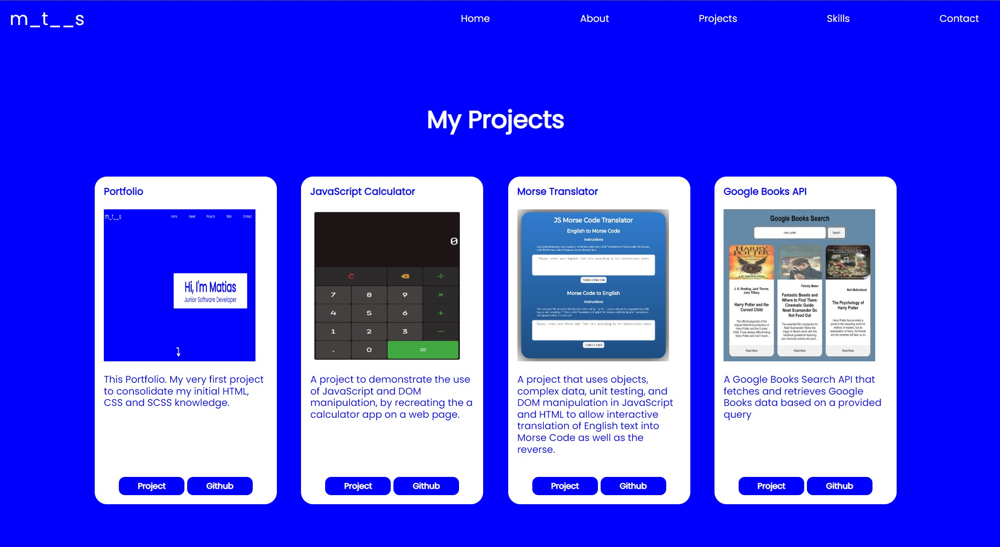
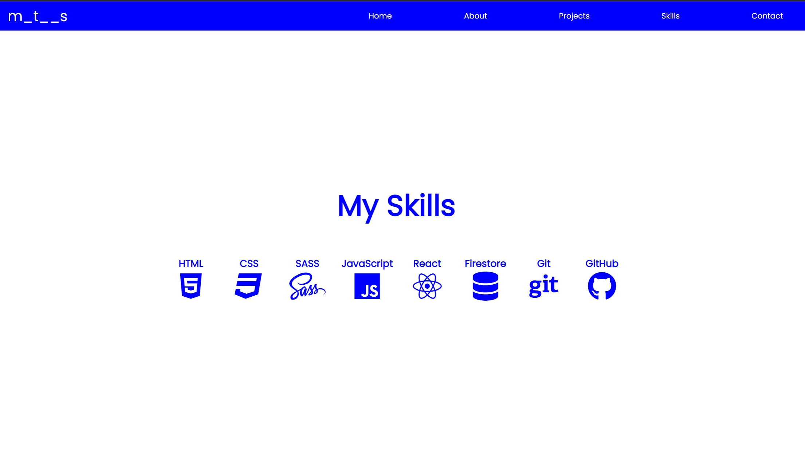
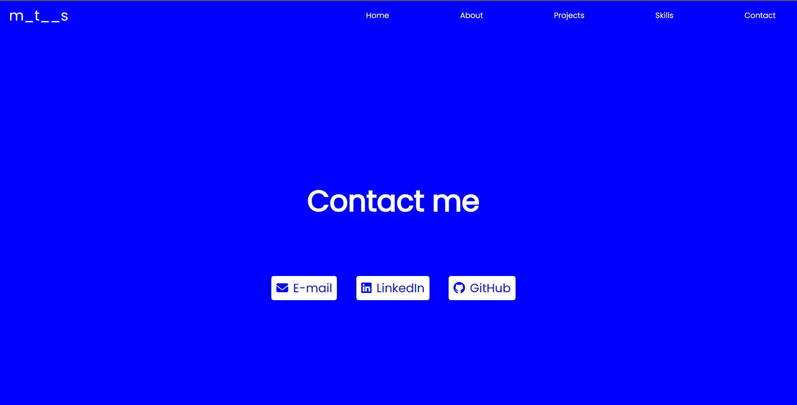

# Portolio Project

## Structure of the Project:

-   Portfolio
    -   img
        -   portrait.jpg
    -   scss
        -   \_partials
            -   \_devices
        -   modules
            -   navbar.scss
            -   hero.scss
            -   about.scss
            -   projects.scss
            -   skills.scss
            -   contact.scss
        -   style.scss
        -   style.css
    -   index.html
        -LICENSE
    -   README.md

## My Process

1. I decided I was going to do a single page portfolio
2. I designed the structure on a piece of paper
3. I wrote the HTML structure in the **index.html** file for every section I've decided to include: Navbar, Hero, About, Projects, Skills, Contact.
4. I created the **style.scss** file
5. I broke the styling process down into smaller pieces (modules):
    - Decide the Palette: Blue and White
    - Style the Navbar
    - Style the Hero Section
    - Style the About Section
    - Style the Projects Section
    - Style the Skills Section
    - Style the Contact Section
6. Once I was satisfied with the overall style on the website, I had to create the media queries to make it responsive
    - Created and assigned the media query for small screens (\_partial)
    - Created and assigned the media query for medium screen (\_partial)
    - Created and assigned the media query for large screens (\_partial)
7. Created the Github Repository (Portfolio)
    - Cloned it
    - git add.
    - git commit -m "message"
    - git push -u origin main

## What would I do if I could do it again?

1. I would start with a mobile-first approach
2. I would try to structure the **SCSS** \_partials and modules better
3. I would use less hard coded values
4. I'd include grids into the styling

## What are some of the problems with the way it is implemented?

1. **SCSS** \_partials and modules are not properly structured or broken down
2. There're a lot of hard coded values in the **SCSS**
3. Not having had a mobile-first approach ended up in a responsive yet weird looking design
4. The flex-direction column has some consequenses in responsiveness and layout placing.

## Screnshoots

