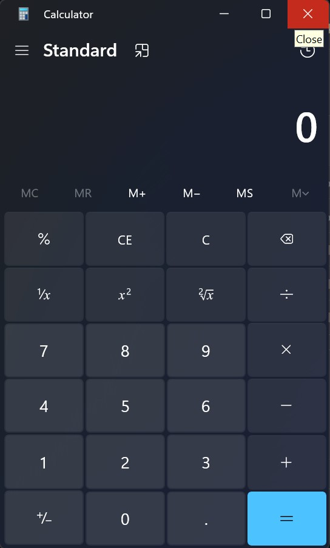
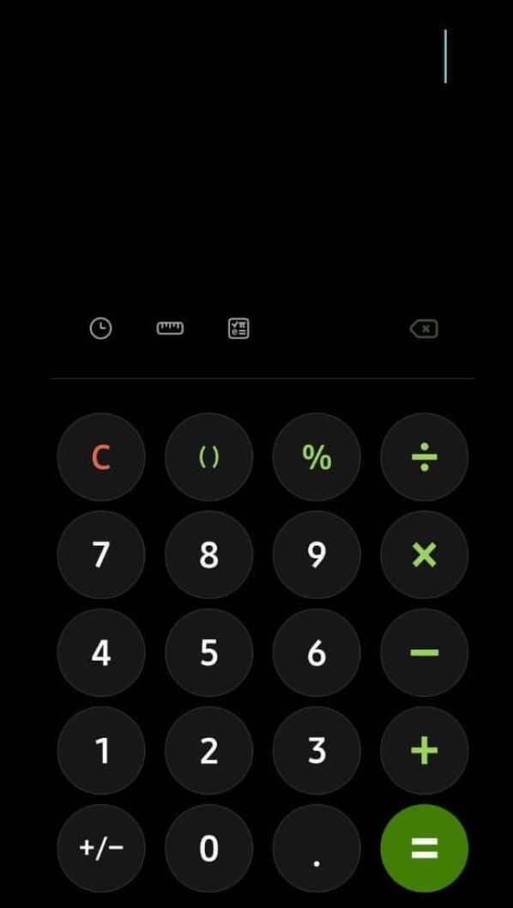
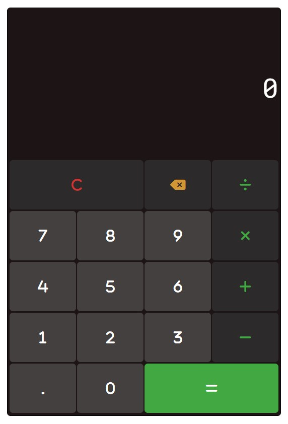

### JavaScript Calculator Project

## Outline

-   Create a README.md on your Calculator repository that includes a picture of the design you will be reproducing
-   Using HTML + SCSS, recreate the design that you chose
-   In the README.md add a breakdown of your project for the JavaScript part of the code. We encourage you to be as granular as possible.
-   Using the project breakdown you've came up with, write the necessary code to make your calculator work.

## MVP

# Part 1

-   1. Create a calculator to be rendered to the html page
-   2. it should have number keys from 0 to 9
-   3. It should have operator keys (+, -, /, \*, =)
-   4. It should have a display rendering the current calculation in a box at the top
-   5. It should also have a “.” key

# Part 2

-   1. Should render the current calculation in a box at the top (calculator display)
-   2. It should handle decimals
-   3. It doesn’t need to support orders of operation
-   4. It should not use eval() or Function() constructor

## Insipration Designs

My design is inspired in a mix between Windows 11 Calculator & Samsung Galaxy Calculator (find images below for reference)

## Breakdown of the JavaScript Block

-   A. Grab the Items from the DOM for later use and manipulation

    -   A.1. Grab all Number Buttons (0-9)
    -   A.2. Grab all Operator Buttons (+, -, \*, /)
    -   A.3. Grab the Decimal Button (.)
    -   A.4. Grab the Equals Button (=)
    -   A.5. Grab the Clear All Button (C)
    -   A.6. Grab the Backspace Button (<-)
    -   A.7. Grab all Buttons from the KeyPad
    -   A.8. Grab all Display Sections (Previous Value and Current Value)
    -   A.9. Grab Previous Value Display
    -   A.10. Grab Current Value Display

-   B. Actions at loading

    -   B.1. Clear Values at first loading
    -   B.2. Declare global variables to use further down the progra

-   C. Actions to happen when I click the different buttons from the calculator

    -   C.1. Press a number Button (0–9) - A.1.1 Add Event Listener to Decide what happens when clicked
        -   C.1.2. If there's a current previous result, I want to clean the display and the calculation string for new calculations to happen
        -   C.1.3. Check if it is a Not Number (currently displayin 0. or !0), and append the button value to the display and set isNewNumber to false
        -   C.1.4. If it is a new value (currently displaying 0, do not append but change the value with the current button value) and set isNewNumber to false
        -   C.1.5. Set PreviousButton Type for future validations
    -   C.2. Press an Operator Button (+, -, ×, ÷)
        -   C.2.1. Add Event Listener to Decide what happens when clicked
        -   C.2.2. Check if the previous value was an operator. If so, operators cannot be selected, it's time to select another number
        -   C.2.3. Validation for chained operations after choosing an operator after a result was already given (A + B = C => Operator). Clear the Previous value display so it can display the new values
        -   C.2.4. Set the display values for Previous and Current Displays
        -   C.2.5. Store the operation type in a variable for future calculation inside Equal's button event listener and previousButtonType checks
        -   C.2.6. Set PreviousButton Type for future validations
    -   C.3. Press the Decimal Button
        -   C.3.1. Add Event Listener to Decide what happens when clicked
        -   C.3.2. Check the previousButtonType to handle decimal notation properly and reset previous value Displayed for a new operation to happen
        -   C.3.3. Check the previousButtonType to handle decimal notation properly
        -   C.3.4. Validations to handle decimal notation properly
        -   C.3.5. If there's already ONE decimal point, no decimal point should be added.
        -   C.3.6. Set PreviousButton Type for future validations
    -   C.4. Press the Equals Button
        -   C.4.1. Add Event Listener to Decide what happens when clicked
        -   C.4.2. If previous button type was equal, equal cannot be pressed again
        -   C.4.3. Previous and Current Display Values Update
        -   C.4.4. Operation Equation
        -   C.4.5. Update Current Value with Result
        -   C.4.6. Set PreviousButton Type for future validations
    -   C5. Press the Clear Button
        -   C.5.1. Add Event Listener to Decide what happens when clicked
        -   C.5.2. Clear all the values letting the calculator ready for a fresh new calculation
    -   C6. Press the Backspace Button
        -   C.6.1. Add Event Listener to Decide what happens when clicked
        -   C.6.2. This button should be disabled if the previous button type was Equal or Clear all, as there's nothing to delete
        -   C.6.3. Set PreviousButton Type for future validations

## Screenshot

