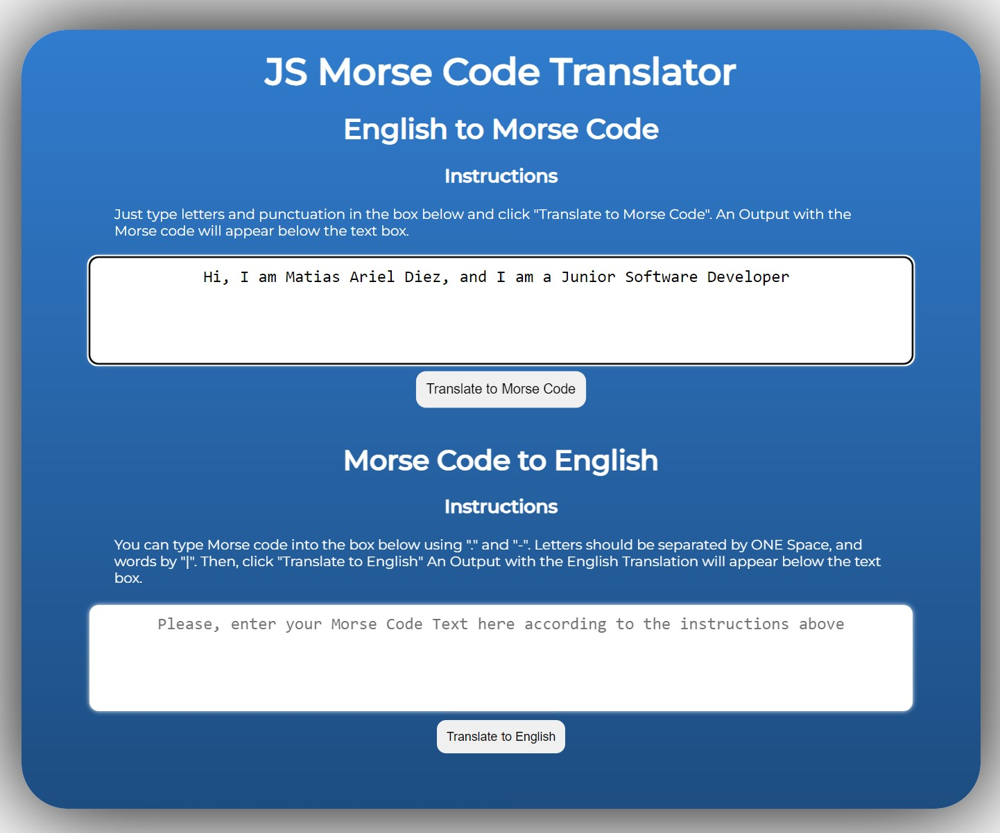

# JS_Morse_Code_Translator

## Outline

This task will require you to create a web page Morse Code translator.
The User Interface will have to look good but should remain simple (additional features, ie. sounds, lights, etc, should only be added once the MVP has been completed.)

## MVP

-   Create a user interface that allows the user to either input some English text or some Morse Code
-   Create JS functions that would allow the user to:
    -   translate their English text into Morse Code
    -   Morse Code into English text
-   Make sure to handle spaces properly (ie. there is 1 space between English words, but one space between Morse Code characters)
-   Make sure to separate pure JS functions and DOM manipulation
-   Add unit testins for each of the pure function that your translator uses (each function should have at least 4 tests, think of edge case, wrong inputs, etc ...)

## English to Morse Code

This translator can only handle characters fomr A to Z (No special characters and no numbers. If any of those are provided, the translator will return a # for those cases.)

## Morse Code to English

Each character must be separated by a single SPACE. And each word must be separated by a "|".

